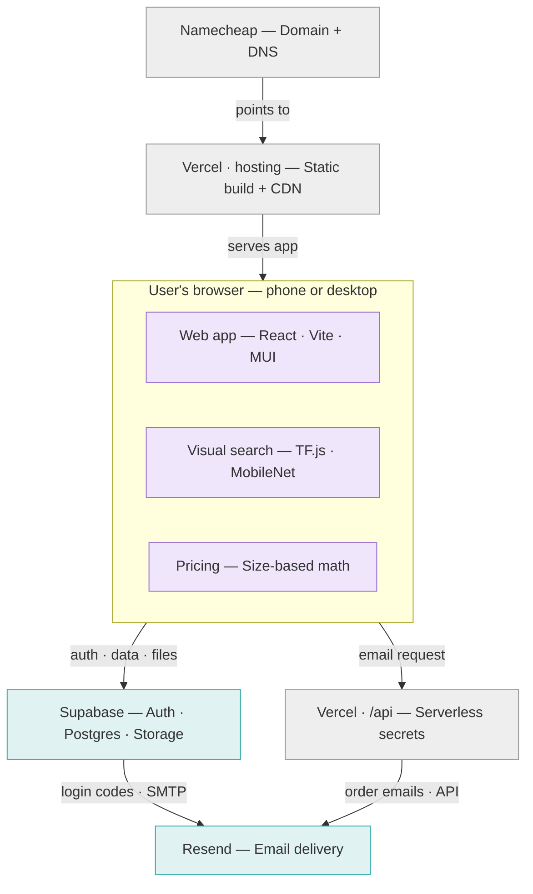

# DFB Smart Shop — Finalized Architecture (for Documentation)

**Status:** Interim‑final — locked for the documentation update.
**Audience:** Documentation team updating the manuscript (Chapter 3 — *System
Architecture and Technical Stack*, *Data Flow and AI Logic*).
**Note:** A second, final revision of this file will be issued once the build is
complete, in case any detail shifts during implementation. The *architecture
pattern* below is final; only minor wording may change later.

> Why this document exists: the original manuscript names **HTML5 + Tailwind +
> Firebase** as the stack. The actual system is being built on **React + Vite +
> MUI + Supabase + Vercel + Resend**. The underlying *pattern* the manuscript
> describes — a serverless app with client‑side AI and a math‑based price engine —
> is unchanged and still correct. Only the named technologies change.

---

## 1. System Architecture and Technical Stack (replaces the manuscript's stack section)

The system is built as a **serverless web application**. There is no custom
backend server: data persistence, authentication, file storage, and email are
delegated to **managed cloud services**, while the artificial‑intelligence and
pricing logic execute **entirely on the client (the user's browser)**. The stack
is organized into four layers.

**1. Presentation / Client Layer.** A single‑page web application built with
**React 19**, **Vite**, and **Material UI (MUI)**, written in **TypeScript**. One
responsive codebase serves three interfaces — the **Admin** (owner) dashboard,
the **Buyer** (customer account) app, and the public **Webshop** — so the system
is usable on both mobile phones and desktop browsers.

**2. Client‑side Intelligence.** The **visual search** runs in the browser using
**TensorFlow.js** with the pre‑trained **MobileNet** model. The **dynamic price
estimator** is a deterministic mathematical formula. Both execute on the user's
device and need no server.

**3. Backend‑as‑a‑Service (BaaS).** **Supabase** provides the **PostgreSQL**
relational database, **user authentication**, and **file storage** for product
images. The client talks to Supabase directly through its SDK, with access
governed by **Row‑Level Security (RLS)** policies. *(This replaces the Firebase
Realtime Database named in the proposal; a relational model improves data
integrity and is easier to document and defend.)*

**4. Serverless Functions & Email.** A small set of **serverless functions
hosted on Vercel** handle any operation that requires a secret key — chiefly
sending **transactional email through Resend** (order received, status changed).
**Supabase Authentication** also delivers its **login codes** and
**password‑reset** emails through Resend (via SMTP).

**Hosting & delivery.** The application is hosted on **Vercel**. The domain is
registered through **Namecheap**, with DNS records pointing the domain to Vercel
and authorizing Resend to send email on the domain's behalf.

### Technical stack at a glance

| Layer | Technology | Responsibility |
| --- | --- | --- |
| Client / UI | React 19, Vite, MUI, TypeScript | Admin, Buyer, and Webshop interfaces (responsive) |
| Client AI | TensorFlow.js + MobileNet | In‑browser visual search (image → category) |
| Pricing | JavaScript (deterministic formula) | Dynamic size‑based price estimate |
| Database / Auth / Storage | **Supabase** (PostgreSQL + Auth + Storage, RLS) | Products, orders, users, promos, recommendations, settings, notifications |
| Serverless logic | Vercel Functions (`/api`) | Secret‑key operations (Resend email, admin tasks) |
| Email | **Resend** | Login codes (via Supabase Auth SMTP) + order emails |
| Hosting | **Vercel** | Static build + CDN + serverless functions |
| Domain / DNS | **Namecheap** (DNS may be delegated to Cloudflare) | Domain registration and DNS records |

### Why these choices (rationale for the defense)

- **One host (Vercel), not two.** Because the AI is client‑side and Supabase is
  the data tier, the only server‑side need is hiding the email API key — a task a
  single Vercel serverless function covers. A separate backend host (e.g.
  Railway) would add cost and complexity for a workload that does not exist.
- **Supabase over Firebase.** A relational schema with real foreign keys and
  constraints is more robust and far easier to present in a manuscript (clean
  entity‑relationship model) than a JSON tree.
- **Resend for email.** Used both as the SMTP provider for Supabase Auth (so
  login codes/resets are delivered reliably) and as the API the Vercel function
  calls for order notifications.

---

## 2. Data Flow and AI Logic (replaces the manuscript's Figure 3.2 section)

When a user submits a photo, the system runs a four‑step pipeline. **Steps 1–3
execute entirely in the browser; only step 4 reaches the cloud.**

1. **Image pre‑processing** — the browser converts the uploaded or captured photo
   into an image tensor that TensorFlow.js can read.
2. **Classification** — MobileNet performs inference and returns its **top‑5
   predicted categories** with confidence scores (e.g. "window screen", "metal").
3. **Keyword bridging** — the application scans those five predictions for
   keywords such as *glass*, *metal*, or *window*. This is the actual
   "intelligence" of the system: it bridges MobileNet's generic vocabulary to the
   shop's catalogue. The bridge relies on the **admin‑set visual‑search keywords**
   stored on each product.
4. **Inventory matching** — if a keyword matches, the system **filters the
   Supabase product list** and shows the relevant category of items.

So the AI's real job is: **photo → general category → keyword → filtered
products.**

### The mathematical pricing model (unchanged)

Pricing is a deterministic formula evaluated in the browser — it is **not**
machine learning:

```
unitPrice = P_base + (W × H × surfaceMultiplier) + ((W + H) × 2 × perimeterMultiplier)
```

with the manuscript's defaults `surfaceMultiplier = 1.5` and
`perimeterMultiplier = 2`, giving the published form:

```
Price = P_base + (W · H · 1.5) + ((W + H) · 2)
```

`P_base` is the material's base price; the surface‑area term reflects material
cost and the perimeter term reflects framing/labour. Both multipliers are
configurable from Admin → Settings, so the constants are justifiable rather than
hard‑coded. Each order line stores its computed `unitPrice` and `lineTotal` so
historical orders keep their original pricing even if the multipliers change
later.

### What is *not* machine learning (state this plainly in the defense)

- **Dynamic pricing** is pure mathematics — no learning.
- **Smart recommendations** ("frequently bought together") are **rule‑based,
  admin‑curated** pairings stored in the database — not a trained recommender.
- **Visual search does category‑level matching, not exact‑SKU recognition.**
  MobileNet is pre‑trained on ~1,000 generic objects; it can tell "this is
  glass / a window" and route the user to that section, but it cannot identify
  "Clear Sliding Glass 5 mm, SKU‑042" specifically. This is appropriate for the
  title's "basic machine learning" framing and should be stated honestly.

---

## 3. Hosting, Domain, DNS, and Email

- **Hosting:** Vercel hosts the static build and the `/api` serverless functions.
- **Domain:** purchased from Namecheap.
- **DNS — two acceptable options:**
  1. **Keep DNS at Namecheap** (simplest): add Vercel's web records plus Resend's
     email records (SPF, DKIM, DMARC) in Namecheap.
  2. **Delegate DNS to Cloudflare** (nicer dashboard, free analytics): change the
     nameservers at Namecheap to Cloudflare and recreate the records there.
     **If Cloudflare is used, set the Vercel records to "DNS only" (grey cloud),
     not proxied** — proxying Cloudflare in front of Vercel stacks two CDNs and
     causes SSL/caching conflicts.
- **Do not host on Cloudflare Pages.** Host the frontend in exactly one place
  (Vercel). Cloudflare's role, if any, is DNS only.
- **Email:** Resend delivers (a) Supabase Auth login codes / password resets via
  SMTP, and (b) order notifications sent from the Vercel function via the Resend
  API. The email API key never reaches the browser.

---

## 4. Manuscript change map (old → new)

Use this to locate and update every affected statement in the manuscript.

| Where in manuscript | Original wording | Replace with |
| --- | --- | --- |
| Stack — Frontend | "HTML5 and Tailwind CSS" | "React 19 + Vite + Material UI (MUI), in TypeScript" |
| Stack — Logic Layer | "JavaScript (ES6+)" | "TypeScript (React components and hooks)" |
| Stack — AI Engine | "TensorFlow.js with MobileNet" | *(unchanged)* TensorFlow.js with MobileNet, client‑side |
| Stack — Backend‑as‑a‑Service | "Firebase Realtime Database" | "Supabase — PostgreSQL + Authentication + Storage (Row‑Level Security)" |
| Data Flow, step 4 | "filters the Firebase product list" | "filters the Supabase product list" |
| Hosting / deployment | *(not specified)* | "Vercel hosting + serverless functions; Namecheap domain; Resend email" |
| Definition of terms — Firebase | "Firebase: a Google‑backed BaaS…" | "Supabase: an open‑source BaaS providing a PostgreSQL database, authentication, and storage" |
| Pricing formula | `Price = P_base + (W·H·1.5) + ((W+H)·2)` | *(unchanged — keep as written)* |
| Scope (offline dependency) | "sync with the Firebase database" | "sync with the Supabase database" |

> The manuscript title ("…with Mobile Application…") refers to the
> **mobile‑responsive web app**, not a separate native app. No native app is
> being built; the Buyer interface is the mobile‑responsive experience.

---

## 5. Diagrams (editable Mermaid source)

The polished SVG diagrams were shared in chat. These Mermaid versions are
provided so documentation can edit/re‑render them in any Markdown/Mermaid tool.

### System architecture



### Visual search data flow


---

## 6. Pending for the final revision (after build)

These will be confirmed and, if needed, corrected in the final pass:

- Confirmed Supabase table names and the entity‑relationship diagram (ERD).
- Exact list of Vercel serverless endpoints (`/api/*`).
- Final DNS record set (Vercel + Resend) and whether Cloudflare is used for DNS.
- Production URL(s) and any environment‑specific notes.
