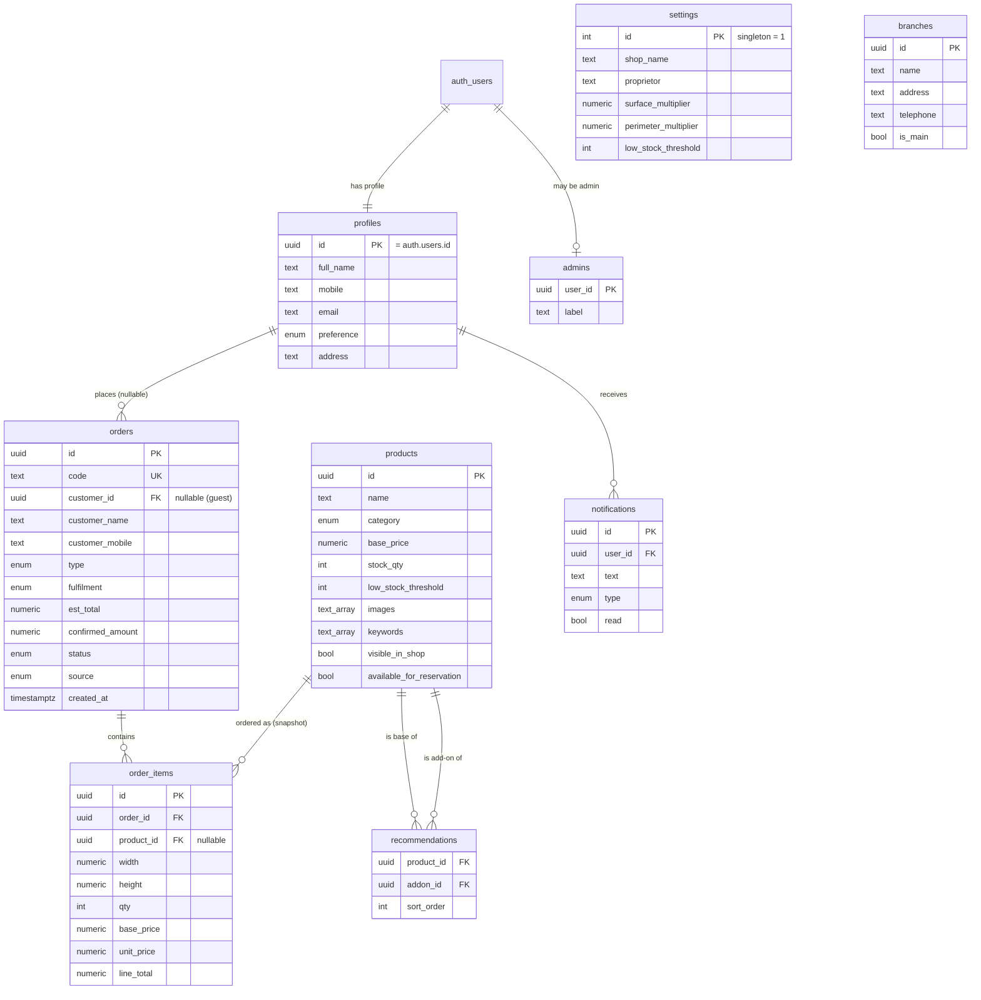

# Supabase — Database (Phase 1)

The relational backend for DFB Smart Shop. This folder **supersedes the Firebase
files** in `../database/` and `../backend/` (see `../docs/ARCHITECTURE.md`).

```
supabase/
├── migrations/
│   ├── 20260618000001_init_schema.sql   # tables, enums, functions, triggers
│   └── 20260618000002_rls.sql           # Row-Level Security policies
└── seed.sql                             # shop profile + catalogue + demo orders
```

**Status:** Validated against PostgreSQL 18 (schema + RLS + seed apply cleanly;
RLS boundary confirmed — public sees only visible products / active promos and
no orders). Not yet applied to the live Supabase project.

## What's inside

- **Tables:** `products`, `orders`, `order_items`, `promos`, `recommendations`,
  `settings`, `branches`, `profiles`, `notifications`, `admins`.
- **Roles/RLS:** public reads the catalogue (visible products, active promos,
  settings, branches); only admins write it. Buyers see only their own orders,
  profile, and notifications. Guests may place orders (Webshop checkout needs no
  account). `admins` is a write-gate table managed by SQL/service-role only;
  `is_admin()` is `SECURITY DEFINER` so policies can call it without recursion.
- **Pricing:** `compute_unit_price(base, w, h, surface_mult, perimeter_mult)`
  implements the dynamic formula (defaults 1.5 / 2). Verified:
  `compute_unit_price(320,36,48) = 3248.00`.
- **Order codes:** auto-assigned `#DFB-####` via a sequence starting at 1043
  (seeded demo codes end at 1042).
- **Seed:** real business profile (DFB Glass and Aluminum Supply, proprietress
  Lorie Bandong, Pasig main + Cainta branch), the 8-product catalogue, promos,
  recommendations, and 10 demo orders (as guest orders).

## Entity-relationship diagram (for the manuscript)



## How to apply

**Option A — Supabase CLI (recommended).** From the repo root:

```bash
supabase link --project-ref <your-project-ref>
supabase db push          # applies migrations to the linked project
# seed.sql runs automatically on local `supabase db reset`; for a remote
# project, run it once via the SQL editor or: psql "$DATABASE_URL" -f supabase/seed.sql
```

**Option B — Dashboard.** Paste each migration (in order), then `seed.sql`, into
the Supabase SQL Editor and run.

**Option C — MCP.** Apply via the Supabase tools (`apply_migration` per file,
then `execute_sql` for the seed).

After applying, generate the typed client used in Phase 3:

```bash
supabase gen types typescript --project-id <id> > frontend/src/lib/database.types.ts
```

## Phase 2 follow-ups (need auth users — done next)

- Create demo auth users: an **admin** (insert their uid into `admins`) and the
  **buyer** Marites Santos.
- Link the four Marites orders (`#DFB-1042`, `1031`, `1025`, `1009`) to her
  `customer_id`, and seed her `notifications`.
- Add a `cancel_order` `SECURITY DEFINER` RPC so buyers can cancel their own
  order while it is still `pending` (kept out of RLS to avoid column-level risk).

## Notes for documentation (discrepancies to reconcile)

- **Business name:** letterhead says *DFB Glass and Aluminum Supply*; manuscript
  says *New DFB Glass & Aluminum*; app brand is *DFB Smart Shop*. Seed uses the
  letterhead name.
- **Proprietor:** real proprietress is **Lorie Bandong** (the mock data's
  "Danilo Bautista" was a placeholder and is not used).
- **Branches:** the real business has a **Main** branch in Pasig and a **Branch**
  in Cainta (F. Manalo St., San Isidro — the location the manuscript describes).
- **Store hours** weren't on the letterhead; seed keeps the placeholder
  *Mon–Sat, 8:00 AM – 6:00 PM* — confirm with the owner.
- **Pricing formula:** implementation/`schema.md` use
  `base + W·H·1.5 + 2·(W+H)·2`; the manuscript's printed form
  `P_base + (W·H·1.5) + ((W+H)·2)` omits the perimeter multiplier. The code is
  authoritative — flag for the manuscript.
